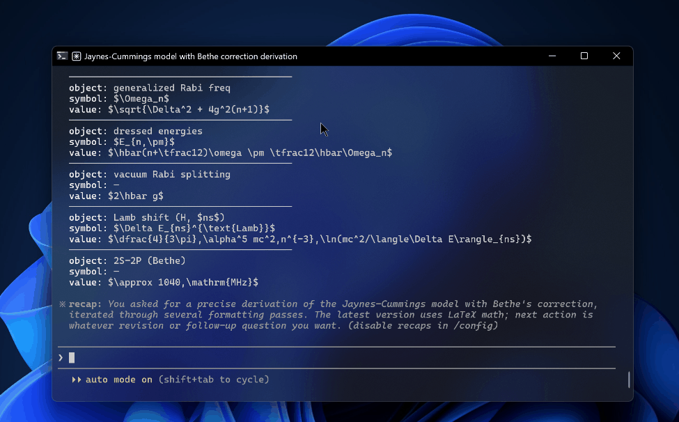

# texpop

*Hotkey LaTeX popup for Claude Code (and Codex, experimentally) — overlays your terminal, picks the focused chat, renders Markdown + KaTeX.*



**Press `Ctrl + Alt + V` in any Claude Code terminal session.**
**The last assistant message renders as Markdown + LaTeX in a window that overlays the terminal exactly.**
**`Esc` closes. Press the hotkey again to refresh with the latest reply.**

texpop is for the people who ask AI assistants to *derive* things, not just refactor them — students, researchers, anyone whose terminal output contains more `\sum` than `;`. The reasoning is already in your transcript on disk; texpop just renders it where it's legible. It's a **LaTeX parser for Claude Code** (and Codex, experimentally) for Windows Terminal, conhost, WezTerm, Hyprland, Sway, and the rest of the post-VS-Code world: KaTeX, focused-chat detection, DPI-correct overlay, fully offline.

---

## Table of contents

- [Why this exists](#why-this-exists)
- [Comparison](#comparison)
- [Features](#features)
- [Install](#install)
- [Use](#use)
- [How it picks the focused chat](#how-it-picks-the-focused-chat)
- [Customisation](#customisation)
- [Adapter coverage](#adapter-coverage)
- [Known limitations](#known-limitations)
- [Troubleshooting](#troubleshooting)
- [Status](#status)
- [Credits](#credits)
- [License](#license)

---

## Why this exists

Every existing LaTeX renderer for Claude assumes you live in a specific surface. VS Code extensions like `claude-code-katex` and MathRender only fire when you run Claude Code as a VS Code task — they're useless if you launch `claude` from Windows Terminal, conhost, WezTerm, or any other terminal. Tampermonkey scripts like `Claude-LaTeX-Parser` and `Claude-LaTeX-Math-Renderer` only target `claude.ai` in the browser — they never see the CLI. And **none** of them solve the harder problem: when you have several Claude Code chats open across tabs and panes, *which* one are you looking at right now? texpop is the first Windows Terminal LaTeX renderer built specifically for terminal-CLI users, and the only one that detects the focused chat instead of guessing the newest file.

---

## Comparison

If you run Claude Code in a terminal, texpop is the only choice — every other tool requires you to be either in VS Code or in the browser.

<details>
<summary>Full feature comparison vs every other LaTeX renderer in the Claude orbit</summary>

| Tool | Surface | LaTeX render | Markdown + math context | Picks focused chat | Window matches terminal | Custom callouts | Offline |
|---|---|:---:|:---:|:---:|:---:|:---:|:---:|
| **texpop** | Terminal (Windows Terminal, conhost, WezTerm, ...) | ✅ KaTeX | ✅ | ✅ | ✅ | ✅ | ✅ |
| claude-code-katex (VS Code) | VS Code only | ✅ KaTeX | ✅ | ❌ | ❌ | ❌ | ✅ |
| MathRender (VS Code) | VS Code only | ✅ MathJax | partial | ❌ | ❌ | ❌ | ✅ |
| Claude-LaTeX-Parser (Tampermonkey) | claude.ai web only | ✅ | partial | ❌ | ❌ | ❌ | ❌ |
| Claude-LaTeX-Math-Renderer (Tampermonkey) | claude.ai web only | ✅ | partial | ❌ | ❌ | ❌ | ❌ |

</details>

---

## Features

- **Hotkey-triggered.** `Ctrl + Alt + V` from any allowlisted terminal, anywhere in your Claude Code session. No menu hunting, no command palette.
- **Focused-chat detection.** PEB CWD reads + UIAutomation tab name + `ai-title` transcript matching pick the chat you're actually looking at, even with five Claude Code tabs open in Windows Terminal.
- **DPI-correct overlay.** The popup window matches the terminal's exact pixel rectangle, with per-monitor DPI v2 awareness — drag your terminal between a 100% and 200% display and it still lines up.
- **KaTeX rendering.** Inline `$...$`, display `$$...$$`, and `\(...\)` / `\[...\]` delimiters all render. Pre-loaded macros for Dirac notation (`\ket`, `\bra`, `\braket`), `\Tr`, blackboard sets (`\R`, `\C`, `\Z`, `\N`), and `\eps`.
- **Full Markdown.** Headings, lists, tables, blockquotes, fenced code blocks — markdown-it 14.x renders the lot, with math interleaved naturally.
- **Custom callout styling.** Patterns like `* Insight ──── body ────` automatically transform into styled callout cards (Insight, Tip, Note, Warning, Danger, Caution, Error, Key-Takeaway).
- **Offline by default.** KaTeX 0.16.x and markdown-it 14.x are vendored locally by `setup.ps1`; once installed, texpop never touches the network.
- **Customisable hotkey.** Edit one line in `texpop.ahk` to rebind to any AutoHotkey v2 combo.
- **Customisable icon.** Drop `assets/icon-override.{svg,png,jpg,ico}` to replace the default `ϕ`-on-disc favicon.
- **Customisable window size.** Pass `-Width` / `-Height` to `show.ps1`, or let texpop auto-size to the terminal.
- **Codex CLI adapter (experimental).** A `ChatSourceAdapter` for Codex CLI ships in `adapters/codex.ps1`. Contributions welcome to harden it.
- **Diagnostic mode.** `Ctrl + Alt + Shift + V` runs the detection cascade without launching the popup and opens the debug log in Notepad.
- **MIT licensed.** Personal-scratch project, but yours to fork, ship, and modify. Windows 10/11 supported.

---

## Install

### Linux

1. **Clone the repo.**

   ```bash
   git clone https://github.com/dyed-eye/texpop.git ~/.local/share/texpop
   cd ~/.local/share/texpop
   ```

2. **Fetch KaTeX and markdown-it.**

   ```bash
   ./setup-linux.sh
   ```

3. **Install the native popup backend if your distro does not ship it.**

   Package names vary, but look for Python 3 bindings for Qt 6 WebEngine
   (`python-pyqt6-webengine`, `python3-pyqt6.qtwebengine`, or similar).

4. **Show the latest local session.**

   ```bash
   ./show-linux.py --source auto
   ```

   Use `--source local`, `--source claude`, or `--session /path/to/session.jsonl`
   when you want deterministic selection.
   On Hyprland, use `--hyprland-mode floating` to overlay the focused terminal
   or `--hyprland-mode tiled` to open as a normal tiled window. On Sway, GNOME,
   KDE, or any non-Hyprland compositor, pass `--hyprland-mode none` (or set
   `TEXPOP_HYPRLAND_MODE=none`) — the default `floating` is a no-op there but
   prints a slight delay while it polls for a `hyprctl` binary that does not exist.

5. **Bind a hotkey in your compositor.**

   Linux does not install a global hotkey by itself. Bind the script in your
   compositor or desktop shortcut settings.

   Hyprland example:

   ```ini
   bind = CTRL ALT, V, exec, ~/.local/share/texpop/show-linux.py --source auto --hyprland-mode floating
   bind = CTRL ALT SHIFT, V, exec, ~/.local/share/texpop/show-linux.py --source auto --hyprland-mode tiled
   ```

   Sway example:

   ```ini
   bindsym Ctrl+Alt+v exec ~/.local/share/texpop/show-linux.py --source auto
   ```

On Hyprland, texpop reads the active window geometry and floats the popup over
the terminal when `--hyprland-mode floating` is used. Sway, GNOME, and KDE can
run the same script, but exact Wayland placement depends on the compositor and
desktop shortcut rules.

### Windows

1. **Install AutoHotkey v2.**

   ```powershell
   winget install AutoHotkey.AutoHotkey
   ```

2. **Clone the repo into your Claude scripts directory.**

   ```powershell
   git clone https://github.com/dyed-eye/texpop.git "$env:USERPROFILE\.claude\scripts\texpop"
   ```

3. **Run setup to fetch KaTeX and markdown-it.** This pulls KaTeX 0.16.x, markdown-it 14.x, and the KaTeX font files into `vendor/`. Idempotent — re-run anytime to refresh.

   ```powershell
   powershell -ExecutionPolicy Bypass -File "$env:USERPROFILE\.claude\scripts\texpop\setup.ps1"
   ```

4. **Double-click `texpop.ahk`.** The green `H` AutoHotkey tray icon appears. The hotkey is now live in any allowlisted terminal.

5. **(Optional) Auto-launch on login.** Drop a shortcut to `texpop.ahk` into `shell:startup` (Win + R, type `shell:startup`, hit Enter, paste the shortcut there).

---

## Use

| Hotkey | Where | What it does |
|---|---|---|
| `Ctrl + Alt + V` | Any allowlisted terminal | Detects the focused Claude Code chat and renders its last assistant message |
| `Ctrl + Alt + Shift + V` | Any allowlisted terminal | Diagnostic mode — runs detection without launching the popup, opens `%TEMP%\texpop-debug.log` in Notepad |
| `Esc` | Inside the popup | Close the popup |

On Linux, the first two rows are whatever shortcut you bind in the compositor.
`Esc` closes the native Qt popup. Browser fallback windows depend on the browser
and window manager, so use the native Qt backend for reliable close behavior.

Typical workflow: you're chatting with Claude Code about a physics or math problem. Claude replies with `\ket{\psi}`, a `$$\hat{H}\ket{\psi} = E\ket{\psi}$$` display equation, and a `* Insight ────` callout summarising the result. In the terminal, that's raw text. Press `Ctrl + Alt + V` and the same reply pops up rendered — properly typeset math, styled callout, syntax-highlighted code blocks. Read it, hit `Esc`, you're back in the terminal. Ask the next question, hit `Ctrl + Alt + V` again to refresh. The popup window is sized and positioned to overlap the terminal exactly, so your eyes don't have to relocate.

---

## How it picks the focused chat

On Windows, texpop matches the foreground window's chat title against the
`aiTitle` recorded in each Claude Code transcript on disk — the session whose
stored title matches the active tab wins. Press `Ctrl + Alt + Shift + V` to dump
the full detection cascade to `%TEMP%\texpop-debug.log` if it ever picks the
wrong chat.

On Linux, the current port first tries to resolve the focused session from the
active Ghostty window, its child shell, and the CLI process's transcript path.
Codex is resolved from open `~/.codex/sessions/rollout-*.jsonl` handles. Claude
Code is resolved from open `~/.claude/projects/*.jsonl` handles, or from the
focused process CWD mapped to Claude's encoded project directory. This works for
separate Ghostty windows on Hyprland. If the resolver cannot identify the active
session, texpop falls back to the newest matching `.jsonl` transcript for the
selected source (`--source local`, `--source claude`, or `--source auto`). Use
`--session /path/to/session.jsonl` when you need a hard override.

---

## Customisation

| What | How |
|---|---|
| Change the hotkey | Edit `^!v::` and `^+!v::` lines in `texpop.ahk`, right-click the tray icon → **Reload Script**. AHK v2 modifiers: `^`=Ctrl, `!`=Alt, `+`=Shift, `#`=Win |
| Replace the icon | Drop a file at `assets/icon-override.{svg,png,jpg,ico}` — first match wins. The bundled fallback is `icon-default.ico` (Tokyo-Night `ϕ`). If it doesn't refresh, delete `%LOCALAPPDATA%\texpop\edge-profile-v3` |
| Add a callout palette | Add a `.callout-yourname { ... }` rule in `template.html` next to the existing `.callout-warning` / `.callout-tip` / `.callout-danger` blocks. Built-in palettes already cover Insight, Tip, Note, Warning, Caution, Warn, Danger, Error, Key-Takeaway |
| Add a terminal exe | Append to the `TerminalExes` array near the top of `texpop.ahk`, reload the script |
| Override popup dimensions | Call `show.ps1 -Width 900 -Height 700` directly. Default behaviour matches the foreground terminal's DPI-corrected pixel rectangle |

---

## Adapter coverage

On Windows, texpop is built around a `ChatSourceAdapter` interface — each AI CLI gets its own adapter file in `adapters/`. The orchestrator in `show.ps1` walks the foreground process tree, then asks each registered adapter "is this yours?" The first adapter to match owns the rest of the pipeline: pick the focused session file, parse the transcript, return the last assistant message as Markdown.

The Linux port currently keeps Claude/Codex transcript parsing in `show-linux.py`.
For Hyprland + Ghostty, it resolves the focused Ghostty window to the CLI
process's active transcript where possible. Other terminal/compositor
combinations fall back to newest-session selection unless you pass `--session`.

| Adapter | File | Status |
|---|---|---|
| Claude Code | `adapters/claude-code.ps1` | Stable, primary target. Reads `~/.claude/projects/<encoded>/*.jsonl`, joins assistant text by `requestId`, matches `aiTitle` against window/tab titles. |
| Codex CLI | `adapters/codex.ps1` | Experimental. Best-effort transcript discovery; format may shift between Codex CLI versions. PRs welcome — verify against your installed Codex version and submit fixes. |

Adding a new Windows adapter is a single PowerShell file that exposes `Name`, `Description`, `Match`, `FindFocusedSession`, `GetLastAssistantTurn` and appends itself to `$script:Adapters`. Use `adapters/claude-code.ps1` as the template.

---

## Under development

These are on the roadmap but not shipped:

- **Linux focused-chat detection outside Ghostty.** The Linux port resolves
  focused Codex and Claude Code sessions for separate Ghostty windows on
  Hyprland. Other terminals and Ghostty tabs/panes still need terminal-specific
  focus plumbing.
- **macOS port.** Similar shape: `skhd`/`Hammerspoon`, `lsof`/`proc_pidinfo`, the macOS Accessibility API, a Safari/Chromium app window. Same "open an issue first" rule.
- **Codex CLI adapter.** `adapters/codex.ps1` ships experimental, doc-driven. The transcript layout was reverse-engineered from Codex CLI documentation and a couple of community blog posts — not from a parsed real session. PRs welcome from anyone running an actual Codex CLI install who can verify the field shapes and tighten the parser.

---

## Known limitations

### `/btw` exchanges may not appear

Claude Code's built-in `/btw` slash command does not always persist its question/answer pair to the session JSONL on disk — at least not synchronously. The exchange shows up live in the terminal but may never reach `~/.claude/projects/<encoded>/<sessionid>.jsonl`, or it lands there with significant delay.

texpop reads from disk. If Claude Code hasn't written the `/btw` exchange to the transcript file by the time you press the hotkey, **there is nothing for texpop (or any external tool) to render** — so the popup falls through to the previous on-disk assistant turn.

The adapter does have detection logic for `/btw` and `/aside`: if the most-recent user message in the transcript starts with `/btw` or `/aside`, the popup prefixes the answer with `## /btw` or `## /aside` so the modal nature is visually explicit. That code is dormant until Claude Code starts persisting these exchanges reliably.

This is upstream behavior, not a texpop bug. Track [`anthropics/claude-code`](https://github.com/anthropics/claude-code) for any change in `/btw` persistence semantics.

---

## Troubleshooting

| Symptom | Likely cause | Fix |
|---|---|---|
| Hotkey doesn't fire | Your terminal exe isn't in the allowlist | Add it to `TerminalExes` in `texpop.ahk` and reload |
| Hotkey doesn't fire | The AutoHotkey process was killed | Re-run `texpop.ahk` (or check the `H` tray icon is present) |
| Wrong session opens | UIA tab title or `aiTitle` mismatch | `Ctrl + Alt + Shift + V` to dump the debug log; check the cascade output in `%TEMP%\texpop-debug.log` |
| Popup is wrong size or off-screen | Per-monitor DPI v2 unavailable | texpop requires Windows 10 build 1703+ for `DPI_AWARENESS_CONTEXT_PER_MONITOR_AWARE_V2`; older builds may fall back to logical pixels |
| `Edge not found` error | Microsoft Edge is missing | Install Edge (`winget install Microsoft.Edge`). texpop requires Edge `--app` mode for the frameless overlay and isolated profile, so this is a hard failure (a generic browser tab would lose `Esc`-to-close and the DPI-correct positioning) |
| Favicon doesn't update after override | Edge cached the old icon | Delete `%LOCALAPPDATA%\texpop\edge-profile-v3` (or run `ie4uinit.exe -show` to refresh the Windows IconCache) and re-trigger |
| `vendor/ missing` error | `setup.ps1` was never run | Run `setup.ps1` to fetch KaTeX and markdown-it |
| Popup is empty / unstyled | Vendor files corrupted or partial download | Re-run `setup.ps1 -Force` to refetch everything |
| No math renders | The reply has no math delimiters | Confirm the reply contains `$...$`, `$$...$$`, `\(...\)`, or `\[...\]` |

---

## Status

Personal-scratch project, MIT licensed. No support guarantees, no roadmap commitments, no SLA — texpop scratches my own itch and I'm publishing it because the same itch keeps showing up in `anthropics/claude-code` issues. PRs are welcome for: new terminal exes, new `ChatSourceAdapter` implementations, new callout palettes, bugfixes, and documentation. Out of scope: VS Code integration (use `claude-code-katex` instead), web-mode rendering (use a Tampermonkey script), and large feature additions that drift from "render the focused chat's last reply, fast." If you want something bigger, fork it.

---

## Credits

Built on the shoulders of:

- **[KaTeX](https://katex.org/)** — fast math typesetting for the web (MIT).
- **[markdown-it](https://github.com/markdown-it/markdown-it)** — pluggable Markdown parser (MIT).
- **[AutoHotkey v2](https://www.autohotkey.com/)** — Windows hotkey + window automation (GPLv2).
- **[Anthropic](https://www.anthropic.com/)** — for [Claude Code](https://github.com/anthropics/claude-code), whose transcripts texpop reads.
- **[OpenAI](https://openai.com/)** — for the [Codex CLI](https://github.com/openai/codex), the experimental second adapter target.

The default favicon is a hand-traced cursive `ϕ` (varphi) on a Tokyo-Night-blue disc.

---

## License

MIT — see [LICENSE](LICENSE).
